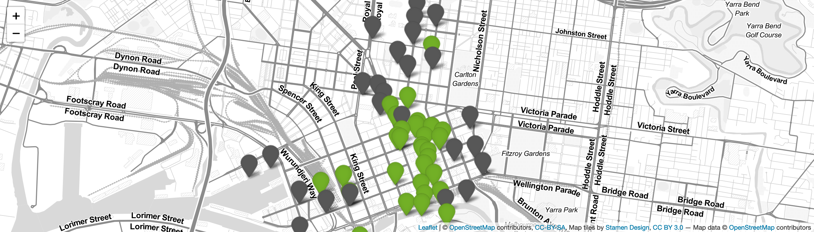

# Pedestrians_Melbourne_Shiny (my first Shiny App)

Simple Shiny App that displays pedestrian traffic in Melbourne's CBD in the last hour. 
The data is fetched from the City of Melbourne's Open Data Portal.

* [Pedestrian Counting System PastHour](https://data.melbourne.vic.gov.au/Transport/Pedestrian-Counting-System-Past-Hour-counts-per-mi/d6mv-s43h).

* CSS obtained [here](https://bootswatch.com/sandstone/)

* Maps created with [Leaflet for R](https://rstudio.github.io/leaflet/)

